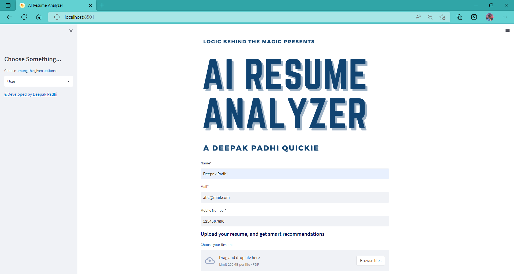
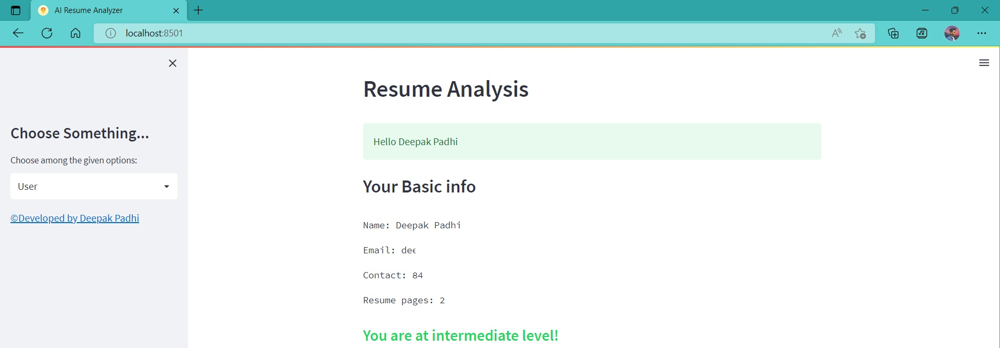
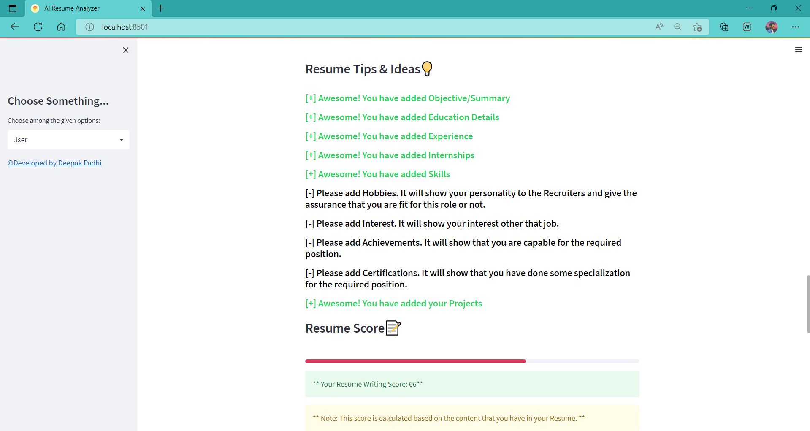
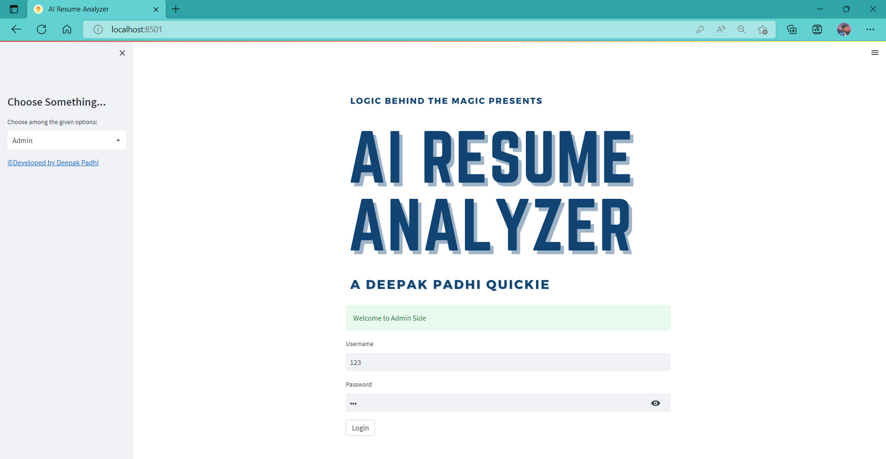

# 🧠 AI Resume Analyzer

A **Streamlit** web application that uses **Natural Language Processing** to analyze PDF resumes, predict career fields, recommend skills and courses, and provide an admin analytics dashboard.

---

## ✨ Features

| Feature | Description |
|---|---|
| 📄 Resume Parsing | Extracts name, email, phone, degree, skills, and page count from any PDF resume |
| 🔍 Career Field Prediction | Classifies candidates into Data Science, Web Dev, Android, iOS, or UI/UX |
| 💡 Skill Recommendations | Suggests in-demand skills based on the predicted field |
| 📚 Course Recommendations | Recommends relevant Udemy, Coursera, and free courses |
| 🏆 Resume Scoring | Scores the resume out of 100 based on section completeness |
| 📊 Admin Dashboard | Visualizes user data with interactive Plotly pie charts |
| 💬 Feedback System | Collects and displays user ratings and comments |

---

## 🖥️ Screenshots

### User View




### Admin Dashboard



---

## 🚀 Getting Started

### Prerequisites

- Python 3.8+
- MySQL 5.7+

### 1. Clone the repository

```bash
git clone https://github.com/your-username/ai-resume-analyzer.git
cd ai-resume-analyzer
```

### 2. Create and activate a virtual environment

```bash
python -m venv venv
source venv/bin/activate        # Linux / macOS
venv\Scripts\activate           # Windows
```

### 3. Install dependencies

```bash
pip install -r requirements.txt
python -m spacy download en_core_web_sm
```

### 4. Configure environment variables

```bash
cp .env.example .env
```

Edit `.env` with your MySQL credentials and desired admin password:

```env
DB_HOST=localhost
DB_USER=root
DB_PASSWORD=your_mysql_password
DB_NAME=resume_analyzer_db

ADMIN_USER=admin
ADMIN_PASSWORD=your_secure_password
```

> ⚠️ Never commit your `.env` file. It is already listed in `.gitignore`.

### 5. Set up the MySQL database

The app creates the database and tables automatically on first run.  
Just make sure your MySQL server is running and the credentials in `.env` are correct.

### 6. Run the application

```bash
cd app
streamlit run app.py
```

Open [http://localhost:8501](http://localhost:8501) in your browser.

---

## 🗂️ Project Structure

```
ai-resume-analyzer/
├── app/
│   ├── app.py                  # Main Streamlit application
│   ├── courses.py              # Course recommendation data
│   ├── Logo/                   # App logo images
│   └── Uploaded_Resumes/       # Temporary storage for uploaded PDFs
├── pyresparser/
│   └── resume_parser.py        # Resume parser wrapper
├── screenshots/                # App screenshots for documentation
├── requirements.txt
├── .env.example
└── .gitignore
```

---

## ⚙️ Configuration

All sensitive configuration is handled through environment variables (see `.env.example`).  
No credentials are hard-coded in the source.

| Variable | Description | Default |
|---|---|---|
| `DB_HOST` | MySQL host | `localhost` |
| `DB_USER` | MySQL username | `root` |
| `DB_PASSWORD` | MySQL password | *(empty)* |
| `DB_NAME` | Database name | `resume_analyzer_db` |
| `ADMIN_USER` | Admin login username | `admin` |
| `ADMIN_PASSWORD` | Admin login password | `changeme` |

---

## 🛠️ Tech Stack

- **Frontend / UI** – [Streamlit](https://streamlit.io)
- **NLP / Parsing** – [spaCy](https://spacy.io), [pyresparser](https://github.com/OmkarPathak/pyresparser), [pdfminer3](https://pypi.org/project/pdfminer3/)
- **Data** – [pandas](https://pandas.pydata.org), [NumPy](https://numpy.org)
- **Visualization** – [Plotly](https://plotly.com/python/)
- **Database** – MySQL via [PyMySQL](https://pymysql.readthedocs.io/)
- **Geolocation** – [geocoder](https://geocoder.readthedocs.io/), [geopy](https://geopy.readthedocs.io/)

---

## 🤝 Contributing

Contributions are welcome!

1. Fork the repository
2. Create a feature branch: `git checkout -b feature/your-feature`
3. Commit your changes: `git commit -m "Add your feature"`
4. Push to the branch: `git push origin feature/your-feature`
5. Open a Pull Request

---

## 📄 License

This project is released under the [MIT License](LICENSE).

---

## 🔮 Roadmap

- [ ] Support for DOCX resumes
- [ ] Expand field detection (Cloud, DevOps, Cybersecurity)
- [ ] Export analysis report as PDF
- [ ] Docker Compose setup for one-command deployment
- [ ] Unit and integration tests
